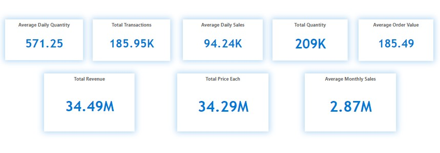
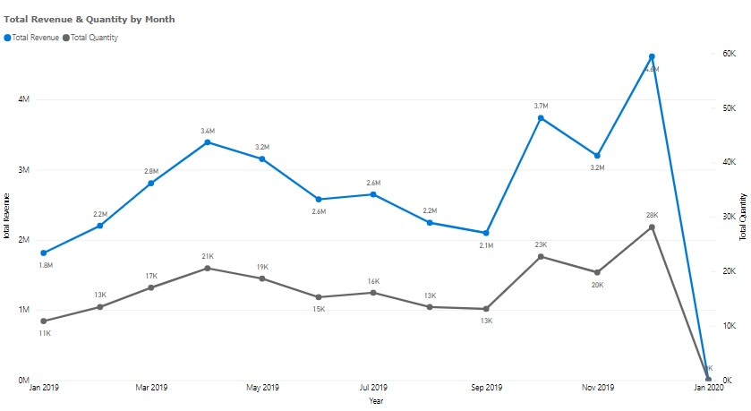
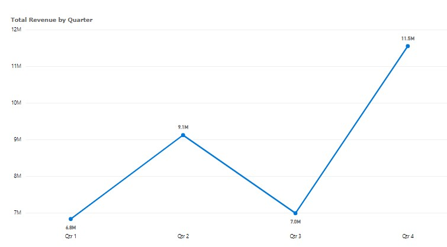
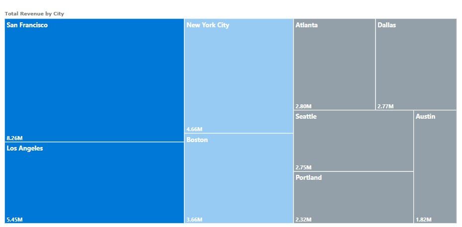
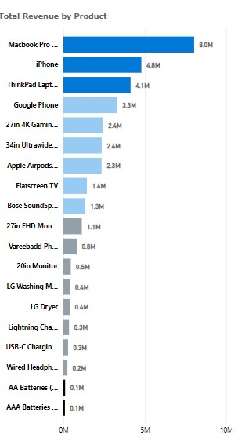
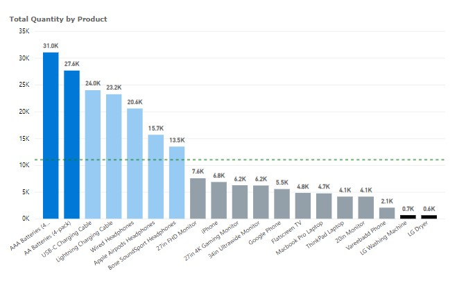
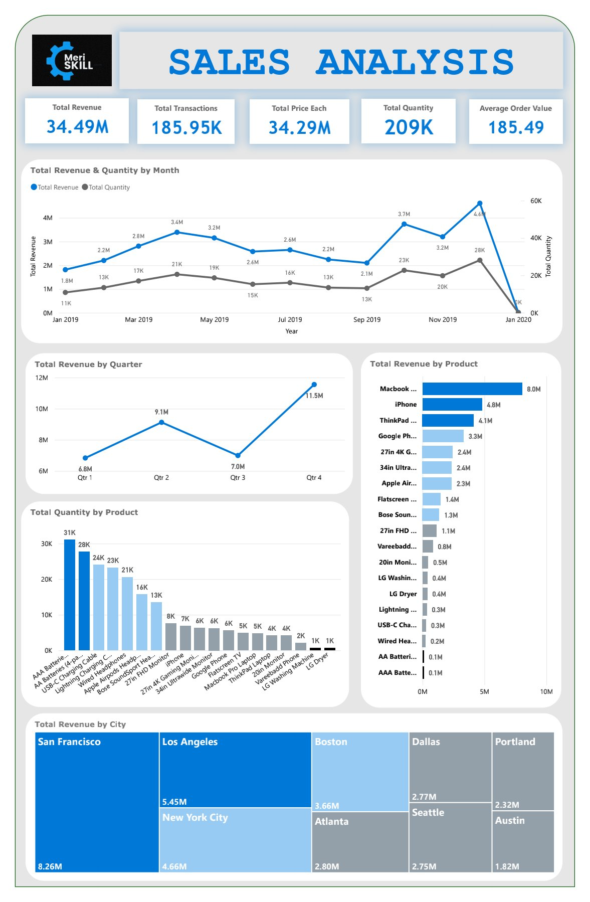
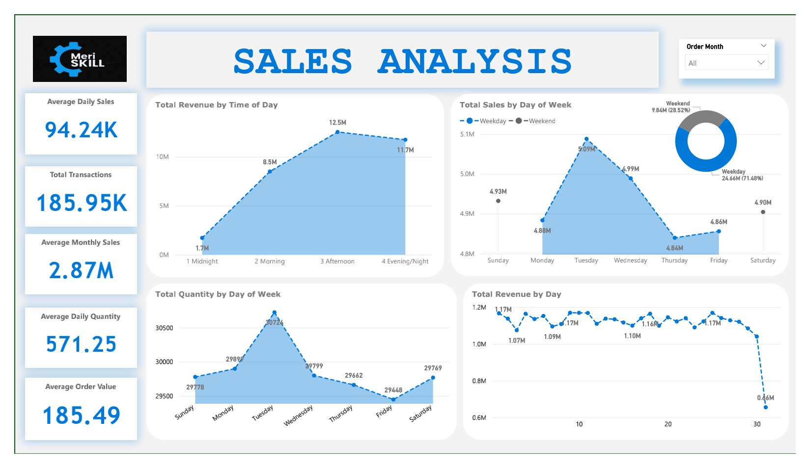

# MeriSkill-Sales-Analysis-Project-

## DESCRIPTION.
In this project, I explored large dataset to extract **valuable insights**, **identify trends**, top selling products and revenue metrics for business decision making. This project showcased my ability to manipulate derive insights from large datasets and make data driven recommendations for optimizing sales strategy. 

## KPIs. 
1. Total Revenue: 34.49M
2. Total Transactions: 185.95K
3. Total Price Each: 34.29M
4. Total Quantity: 209K
5. Average Order Value: 185.49
6. Average Daily Sales: 94.24K
7. Average Monthly Sales: 2.87M
8. Average Daily Quantity: 571.25
9.  Total Products sold: 19 products
    

## INSIGHTS.
•	The month of December, 2019 generated the highest amount in revenue and quantity sold, generating 4.6 million and 28,114 in revenue and quantity sold respectively. October, 2019. January generated 1.8 million in revenue and also 10,862 in quantity sold, which was the lowest for the year 2019.

•	The 4th quarter of 2019 (month comprising of October, November and December) had the most revenue, generating a total sale of 11.5 million, the 4th quarter accounted for 33.49% of the total revenue.  The trend proves that revenue is was at its peak during the holiday season. 

 •The 1st quarter had the least revenue with a total of just 6.8 million for the month of January, February and March. The 3rd quarter was not far off in terms of revenue from the         1st, with a total sale of approximately 7 million. 
  

•	The city of San Francisco generated the highest amount in revenue and quantity ordered. San Francisco had total revenue of 8.26 million and a total of 50,239 total products. The city of Los Angeles comes in second with 5.45 million and 33,289 in revenue and quantity ordered respectively.

  • The city of Austin and Portland generated the least amount in terms of revenue and also in quality ordered. Portland sold 2.32 million in revenue and 14,053 in quantity                  ordered, Austin on the other hand sold just 1.82 million in revenue and 11, 153.

•	In terms of total revenue by product, the top 3 selling products in terms of revenue generated were the MacBook Pro Laptop, iPhone and the ThinkPad Laptop, making total yearly revenue of 8 million, 4.7 million and 4.1 million respectively. 

•	Considering the fact that AAA Batteries (4 pack) and AA Batteries (4 pack) sold the very least in revenue, selling just 92.74K and 106.12K respectively. This pair sold the most in terms of quantity. Total quantity reaching up to 31, 000 for the AAA Batteries (4 pack) and 27, 635 for the AA Batteries (4 pack).

  •	The Top Three selling products (MacBook Pro Laptop, iPhone and the ThinkPad Laptop) fell below average in terms of quantity sold. Selling 4728 MacBook Pro Laptops, 6847 iPhones and     4130 ThinkPad Laptops. 

  

•	The Peak of revenue was in the Afternoon (12PM – 5:59PM) and Evening/Night (6PM – 11:59), generating up to 12.5 Million and 11.7 million respectively. 

•	Most of the total sale 24.66M (71.48%) was generated on a Weekday. Particularly Tuesday and Wednesday were the peak days for revenue. The Weekend generated a total sale of 9.84M (28.52%). 

# DASHBOARD & OVERVIEW 
### At the end of my analysis, i created two dashboards 
The first which is a yearly over view of sales performance

I further drilled down, to view how sales performed on a weekly basis, with a filter at the top right corner to view according to the **order month**

# CONCLUSION 
### I uploaded the PowerBi workbook to view the project and you can also interact with the dashboard on PowerBi services here https://lnkd.in/d7aw6RQz : 

# THANK YOU!
